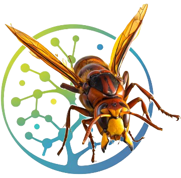
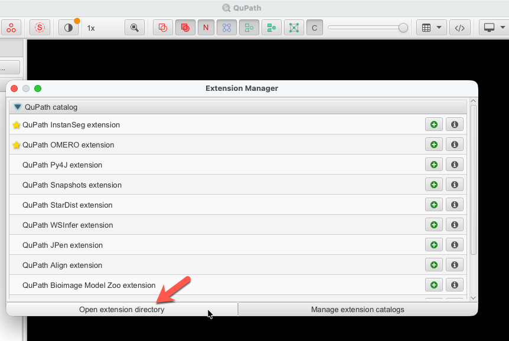

<p align="center">
  
</p>

<h1 align="center">VeSpA: QuPath Extension for Vessel Spatial Analysis</h1>

<p align="center">
  <em>Interactive vessel segmentation and morphometric quantification for histological images, directly inside QuPath</em>
</p>

<p align="center">
  
  
  
  
</p>

---

## Abstract

**VeSpA** (**Ve**ssel **Sp**atial **A**nalysis) is a QuPath extension for vessel segmentation and morphometric analysis in histological whole-slide images and selected regions of interest. The extension couples a QuPath-native Java interface with a Python-based image-processing pipeline, enabling annotation-guided analysis, TMA-core analysis, whole-image processing, reconstruction of vessel polygons in the QuPath hierarchy, and direct import of per-vessel measurements. By combining configurable signal extraction (CMYK Yellow by default, with optional DAB stain deconvolution for H-DAB slides), adaptive thresholding, morphological cleanup, lumen-aware filling, and morphometric extraction, VeSpA supports reproducible vessel analysis without leaving the QuPath environment.

---

## Repository Scope

This repository is the **QuPath extension layer** of VeSpA.

It contains:

- the Java extension entry point
- the QuPath GUI and menu integration
- Python configuration and environment management dialogs
- whole-image, annotation, and TMA-core execution logic
- polygon reconstruction and measurement import back into QuPath
- bundled resources such as icons and the reference Python script used by the extension

Repository:

- [`ComputationalPathologyLab/VeSpA`](https://github.com/ComputationalPathologyLab/VeSpA)

This repository currently serves as the public home of the VeSpA QuPath extension and its bundled reference segmentation script.

---

## Background and Motivation

Quantification of vascular architecture in tissue sections is central to studying tumour microenvironments, organ development, tissue remodelling, and vascular pathology. Manual counting and tracing are slow, observer-dependent, and difficult to reproduce at scale. Script-only pipelines may automate segmentation, but often lose the spatial context that pathologists and image analysts establish inside QuPath.

VeSpA addresses this gap by integrating a configurable vessel-segmentation workflow directly with the QuPath object hierarchy so that:

- annotations define the exact biological regions to analyse
- TMA cores can be processed as independent parent regions
- detections return as native QuPath polygon objects in image coordinates
- morphometric measurements are attached to each reconstructed vessel
- the full workflow remains accessible through a GUI rather than custom scripting

---

## Architecture

VeSpA follows a two-layer design:

1. **QuPath extension layer (this repository)**
   - Java/Gradle project
   - GUI, menus, execution control, progress reporting
   - annotation, TMA-core, and whole-image export / import workflows
   - Python environment configuration

2. **Python segmentation layer**
   - vessel segmentation logic
   - signal extraction
   - lumen filling
   - contour export
   - morphometric extraction

At present, this extension repository bundles the reference script at:

- `src/main/resources/scripts/vessels_segmentation.py`

This allows the extension to run in QuPath while the broader VeSpA Python backend continues to evolve as a standalone repository.

---

## Workflow Overview

VeSpA processes each selected region through a deterministic segmentation pipeline.

```text
Input image or exported annotation/TMA/whole-image region
         │
         ▼
 1. Signal extraction
    CMYK Yellow channel (default)
    or DAB stain deconvolution (optional)
         │
         ▼
 2. Adaptive thresholding
    Otsu (automatic) or percentile (manual)
         │
         ▼
 3. Morphological cleanup
    Dilation → Erosion
         │
         ▼
 4. Vessel wall refinement
    Contour detection + minimum area filtering
         │
         ▼
 5. Lumen detection and filling
    Wall repair → background flood-fill → candidate isolation
    → shape filtering → lumen expansion and merge
         │
         ▼
 6. Final connected-component filtering
         │
         ▼
 7. Measurement extraction
    area, axes, eccentricity, orientation
         │
         ▼
 8. Contour export → polygon reconstruction in QuPath
         │
         ▼
 9. Measurement import into QuPath hierarchy
```

---

## Key Features

| Capability | Detail |
|---|---|
| Annotation-scoped segmentation | Detect vessels only inside selected QuPath annotations |
| Multi-annotation batch processing | Process multiple annotations in one run with per-region progress feedback |
| Whole-image processing | Analyse the full image when region-based scoping is not required |
| TMA core support | Works with QuPath objects and ROI export workflows used in TMA analysis |
| Native QuPath reconstruction | Rebuild vessels as polygon ROIs directly in the QuPath hierarchy |
| Measurement import | Attach vessel-level measurements to reconstructed objects |
| Configurable signal extraction | Supports CMYK Yellow by default and optional DAB stain deconvolution for H-DAB images |
| Dual threshold modes | Otsu and percentile-based thresholding |
| Lumen-aware segmentation | Fills biologically plausible luminal spaces using geometric filtering |
| Preset-driven GUI | Balanced, Sensitive, Fragmented walls, and Strict cleanup presets |
| Integrated Python management | Configure, test, validate, install, and reset the Python environment from the extension |
| In-QuPath execution | No external notebook or manual CSV post-processing required |

---

## GUI Overview

The current VeSpA interface is designed for routine use inside QuPath without leaving the viewer context.

- **Sidebar status area** shows image state, current selection/TMA availability, and Python readiness
- **Input Region** supports `Selected annotation(s)`, `TMA cores`, and `Whole image`
- **Segmentation Preset** provides quick starting points for common vessel appearances
- **Quick Controls** expose signal extraction mode, thresholding mode, and minimum vessel area
- **Advanced Tuning** contains lumen detection, wall repair, morphology, and lumen expansion controls
- **Run panel** provides live progress updates and an in-window processing log

This layout is intended to preserve a pathologist-friendly workflow while still exposing the core segmentation parameters.

---

## Segmentation Presets

Presets provide practical starting points for different vessel appearances while keeping all individual parameters editable.

| Preset | Intended use | Typical emphasis |
|---|---|---|
| **Balanced** | General-purpose use | Conservative defaults for typical vessel morphology |
| **Sensitive** | Small, faint, or low-contrast vessels | Higher sensitivity and lower effective filtering |
| **Fragmented walls** | Discontinuous or poorly closed vessel boundaries | Stronger wall repair and lumen expansion |
| **Strict cleanup** | Noisy tissue or artefact-rich sections | Tighter filtering and stronger cleanup |

---

## Outputs

For each processed region, the extension/Python pipeline produces:

| File | Content |
|---|---|
| `*_binary.png` | Final binary vessel mask |
| `*_overlay.png` | Overlay image showing segmented vessels |
| `*_measurements.csv` | Per-vessel morphometric measurements |
| `vessel_contours.csv` | Polygon contour coordinates used for QuPath reconstruction |

Imported QuPath vessel objects receive measurements including:

- `VeSpA: Vessel ID`
- `VeSpA: Area`
- `VeSpA: Major axis length`
- `VeSpA: Minor axis length`
- `VeSpA: Eccentricity`
- `VeSpA: Orientation`

Parent annotations and TMA cores also receive summary statistics such as:

- vessel count
- total vessel area
- mean vessel morphometric values

---

## Requirements

### QuPath

- QuPath `0.6.0` or later
- Java `21`

### Python

- Python `3.9+`
- `opencv-python >= 4.10, < 5`
- `numpy >= 1.26, < 3`
- `scikit-image >= 0.24, < 1`
- `pandas >= 2.2, < 3`

The extension can manage a dedicated VeSpA Python environment through the **Configure Python** dialog.

---

## Installation

### Recommended: install through the ComputationalPathologyLab QuPath catalog

1. Open **QuPath**.
2. Go to **Extensions → Manage extensions**.
3. Click **Manage extension catalogs**.
4. Add the following catalog URL:

```text
https://raw.githubusercontent.com/ComputationalPathologyLab/qupath-extension-catalog/main/catalog.json
```

5. Return to the Extension Manager.
6. Locate **VeSpA** under the **ComputationalPathologyLab QuPath Catalog**.
7. Click install and allow QuPath to download the release-hosted JAR automatically.
8. Restart QuPath if required.

### Manual installation (fallback)

If you prefer a manual installation, download the current release JAR from:

- <https://github.com/ComputationalPathologyLab/VeSpA/releases>

The current release asset is named:

```text
qupath-extension-vespa-0.1.0.jar
```

To install manually:

1. Open **QuPath**.
2. Open the **Extension Manager**.
3. Click **Open extension directory** to locate the QuPath extensions folder.
4. Copy `qupath-extension-vespa-0.1.0.jar` into that directory.



5. Restart QuPath.

> Keep only one VeSpA extension JAR installed at a time to avoid duplicate menu entries.

### Configure Python

After the extension is installed:

1. Launch VeSpA from the QuPath menu.
2. Click **Configure Python**.
3. Select or auto-detect a Python interpreter.
4. Test the interpreter and install dependencies if needed.
5. Save the configuration and return to the main VeSpA window.

After installation, launch the extension from:

```text
Extensions > Vessel Segmentation > Run Vessel Segmentation
```

---

## Python Configuration

Open **Configure Python** from the VeSpA interface to:

- browse to a Python executable
- auto-detect common Python installations
- test the selected interpreter
- check whether required packages are available
- install VeSpA dependencies
- reset the configured environment

When configuration succeeds, the GUI displays **Python Ready**. If the interpreter is missing or invalid, the GUI reports **Python Missing** until a valid executable is saved.

---

## Usage

### Annotation-based segmentation

1. Open an image in QuPath.
2. Draw or select one or more annotations.
3. Open **Extensions > Vessel Segmentation > Run Vessel Segmentation**.
4. Select **Selected annotation(s)**.
5. Choose a preset or tune parameters manually.
6. Click **Run Segmentation**.

Each annotation is exported, processed independently, and re-imported as vessel detections attached to the corresponding parent annotation.

### TMA core segmentation

1. Open an image in QuPath with a TMA grid designated.
2. Open **Extensions > Vessel Segmentation > Run Vessel Segmentation**.
3. Select **TMA cores**.
4. The sidebar shows how many valid cores are available.
5. Choose a preset or tune parameters manually.
6. Click **Run Segmentation**.

Each non-missing TMA core is exported, processed independently, and re-imported as vessel detections attached to the corresponding core object. Summary measurements are added to each core.

### Whole-image segmentation

1. Open an image in QuPath.
2. Launch VeSpA.
3. Select **Whole image**.
4. Choose a preset or adjust parameters.
5. Click **Run Segmentation**.

Use whole-image mode only when system memory and image size permit practical processing.

### Choosing a signal extraction mode

- **CMYK Yellow** is the default and preserves the original VeSpA preprocessing behavior.
- **DAB stain deconvolution** is intended for brightfield H-DAB images where stain-separated DAB optical density may provide cleaner vessel signal.

In practice, CMYK Yellow is a good default starting point. DAB mode is most useful when vessels are specifically labeled with DAB and the raw RGB contrast is less reliable than stain-separated signal.

---

## Parameter Reference

### Quick Controls

| Parameter | Default | Description |
|---|---|---|
| Signal extraction mode | `CMYK Yellow` | Default CMYK Yellow preprocessing, or optional DAB stain deconvolution for H-DAB images |
| Threshold mode | `otsu` | Automatic Otsu thresholding or manual percentile thresholding |
| Percentile value | `10` | Used only in percentile mode; valid range `1–99` |
| Minimum vessel area | `500 px²` | Removes small connected components after segmentation |

### Advanced Tuning — Lumen Detection

| Parameter | Default | Description |
|---|---|---|
| Min lumen area | `200 px²` | Ignore very small lumen-like holes |
| Max lumen area | `80 000 px²` | Ignore implausibly large holes |
| Circularity min | `0.20` | Lower values allow more elongated lumens |
| Eccentricity max | `0.97` | Excludes near-linear artefacts |

### Advanced Tuning — Wall Repair

| Parameter | Default | Description |
|---|---|---|
| Closing kernel size | `28 px` | Repairs fragmented vessel walls |
| Closing iterations | `2` | Additional passes strengthen closure |

### Advanced Tuning — Morphology

| Parameter | Default | Description |
|---|---|---|
| Dilation width / height | `21 × 21 px` | Initial binary cleanup expansion |
| Dilation iterations | `1` | Number of dilation passes |
| Kernel shape | `ELLIPSE` | `ELLIPSE`, `RECT`, or `CROSS` |
| Erosion width / height | `3 × 3 px` | Boundary restoration after dilation |
| Erosion iterations | `2` | Number of erosion passes |

### Advanced Tuning — Lumen Expansion

| Parameter | Default | Description |
|---|---|---|
| Expansion kernel size | `5 px` | Dilation applied to validated lumens |
| Expansion iterations | `3` | Controls bridging of larger inner-wall gaps |

---

## Troubleshooting

**Extension does not appear in QuPath**  
Confirm that the JAR is in the correct QuPath extensions folder and restart QuPath fully.

**Python Missing status**  
Open **Configure Python**, select a valid interpreter, run **Test**, then save the configuration.

**Missing Python packages**  
Use **Check environment** and then **Install dependencies** from the Python configuration dialog.

**Segmentation fails during processing**  
Inspect the in-plugin log panel and confirm that `cv2`, `numpy`, `scikit-image`, and `pandas` are available in the configured Python environment.

**No TMA grid was found in the current image**  
TMA-core mode requires a valid QuPath TMA grid. Switch to annotation or whole-image mode if the slide is not a TMA project.

**DAB stain deconvolution fails**  
Confirm the image is a brightfield H-DAB-style input and that the Python environment includes a working `scikit-image` installation.

**Duplicated measurements in QuPath**  
This may occur when the same annotation is processed repeatedly without clearing prior VeSpA detections.

**Unexpected percentile-threshold results**  
Compare with Otsu mode first; very low percentile values may increase noise substantially.

**Out-of-memory errors**  
Prefer selected annotations over whole-image mode for very large images. Very large images may exceed available memory depending on system specifications.

---

## Project Structure

```text
qupath-vessel-segmentation-1/
├── src/main/java/com/rashid/qupath/vesselseg/
│   ├── VesselSegmentationExtension.java
│   └── PythonConfigDialog.java
├── src/main/resources/
│   ├── images/
│   └── scripts/vessels_segmentation.py
├── build.gradle
├── settings.gradle
└── README.md
```

Key responsibilities:

- `VesselSegmentationExtension.java` — GUI, execution control, region export, progress, and QuPath import
- `PythonConfigDialog.java` — Python interpreter setup and dependency validation
- `vessels_segmentation.py` — signal extraction, thresholding, morphology, lumen filling, contour export, and measurements

---

## Development Notes

- The bundled Python backend is packaged from `src/main/resources/scripts/vessels_segmentation.py`
- QuPath import expects `vessel_contours.csv` and `*_measurements.csv` outputs from the Python pipeline
- For large refactors, preserve compatibility with all three input-region modes:
  - selected annotations
  - TMA cores
  - whole image

---

## How to cite VeSpA

If you use VeSpA in your research, please cite the preprint:

**Grion G, Hussain R, Colella FE, Roufail K, Uccella S, Frapolli R, Matteo C, Mintemur O, Pennati F, Renne SL.** *Vessel Spatial Analysis (VeSpA): a tool for whole slide image segmentation, morphometry, and QuPath extension.* bioRxiv. 2026. DOI: [10.64898/2026.06.15.732366](https://doi.org/10.64898/2026.06.15.732366)

Preprint:
- <https://www.biorxiv.org/content/10.64898/2026.06.15.732366v1>

### BibTeX

```bibtex
@article{grion2026vespa,
  title   = {Vessel Spatial Analysis (VeSpA): a tool for whole slide image segmentation, morphometry, and QuPath extension},
  author  = {Grion, Giulia and Hussain, Rash and Colella, Filippo Emanuele and Roufail, Kirollos and Uccella, Silvia and Frapolli, Roberta and Matteo, Cristina and Mintemur, {"O}mer and Pennati, Francesca and Renne, Salvatore Lorenzo},
  journal = {bioRxiv},
  year    = {2026},
  doi     = {10.64898/2026.06.15.732366},
  url     = {https://www.biorxiv.org/content/10.64898/2026.06.15.732366v1}
}
```

### DOI

```text
10.64898/2026.06.15.732366
```

### RIS

```text
TY  - JOUR
TI  - Vessel Spatial Analysis (VeSpA): a tool for whole slide image segmentation, morphometry, and QuPath extension
AU  - Grion, Giulia
AU  - Hussain, Rash
AU  - Colella, Filippo Emanuele
AU  - Roufail, Kirollos
AU  - Uccella, Silvia
AU  - Frapolli, Roberta
AU  - Matteo, Cristina
AU  - Mintemur, Ömer
AU  - Pennati, Francesca
AU  - Renne, Salvatore Lorenzo
JO  - bioRxiv
PY  - 2026
DO  - 10.64898/2026.06.15.732366
UR  - https://www.biorxiv.org/content/10.64898/2026.06.15.732366v1
ER  - 
```

### Suggested reference format

Grion G, Hussain R, Colella FE, Roufail K, Uccella S, Frapolli R, Matteo C, Mintemur O, Pennati F, Renne SL. Vessel Spatial Analysis (VeSpA): a tool for whole slide image segmentation, morphometry, and QuPath extension. bioRxiv. 2026. doi:10.64898/2026.06.15.732366
